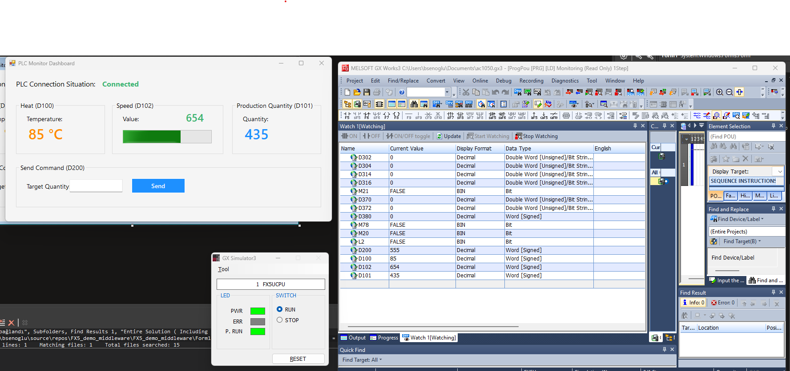
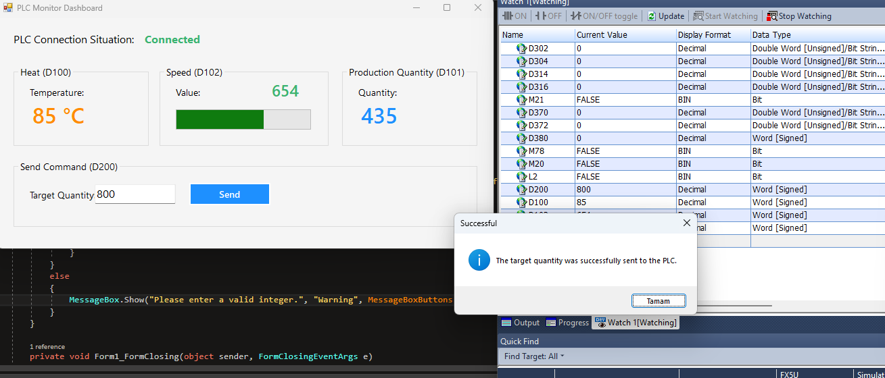
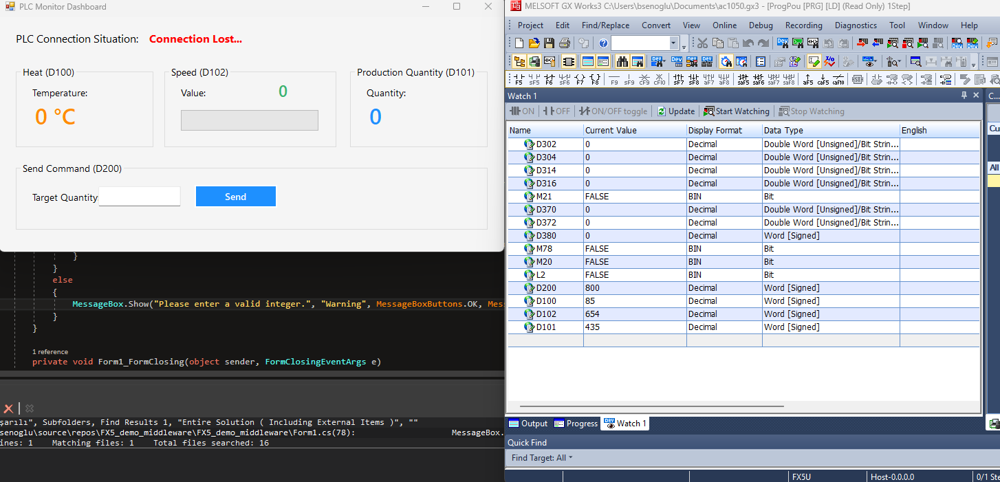
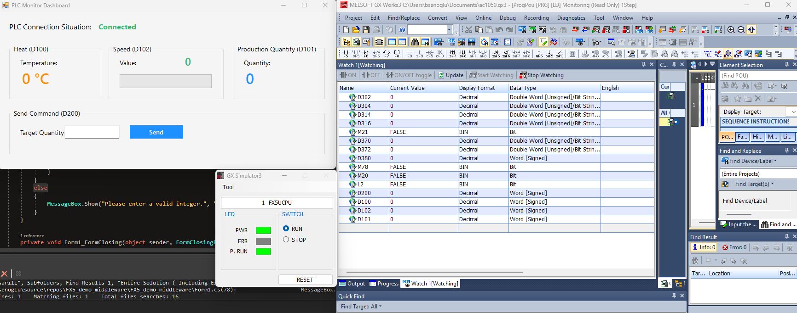

# Industrial iQ-F Gateway: Enterprise-Grade PLC Middleware 🏭

This is a high-performance, **SOLID-compliant** middleware solution designed for robust data acquisition and control between **Mitsubishi iQ-F Series (FX5U) CPUs** and high-level applications. It bridges the gap between the factory floor (OT) and enterprise software (IT).

---

## 🏗 Modular Architecture

This project is built with a **decoupled service-oriented architecture** to ensure scalability:

* **`Interfaces/`**: Hardware abstraction layer (`IPLCService`, `IDataLogger`).
* **`Services/`**: Low-level implementation of the **MX Component (ActUtlType64)**.
* **`Managers/`**: Orchestrates business logic and heartbeat mechanisms.
* **`Models/`**: Strongly-typed data structures (`PlcData`).

---

## 🚀 Key Engineering Features

### 1. Real-Time Telemetry & Monitoring
The system handles bi-directional communication with a **200ms non-blocking polling rate**, ensuring real-time data flow without UI freezing.

**Visual Proof:**

*Figure 1: Real-time monitoring of D-Registers.*

---

### 2. Command Execution (Write-Back)
Provides a secure interface to write operational parameters directly to the PLC memory.

**Visual Proof:**

*Figure 2: Dynamic setpoint management.*

---

### 3. Smart Reconnection Logic (Self-Healing)
Engineered for the "harsh" reality of industrial networks. The system detects interruptions and attempts to re-establish the socket every 5 seconds (**Back-off strategy**) to prevent socket exhaustion.

**Fault-Tolerance Display:**

  
  

*Figure 3 & 4: Automatic state transition from 'Connection Lost' to 'Reconnected'.*

---

## 🛠 Tech Stack & Requirements

* **Language:** C# / .NET Framework 4.6.1
* **Library:** ActUtlType64Lib (Mitsubishi COM Library)
* **Build Target:** x64 (Optimized for Industrial PCs/IPCs)
* **Hardware:** Mitsubishi FX5U Series

## 💼 Why This Matters?
This project demonstrates expertise in **System Architecture**, **Hardware-Software Interoperability**, and **Exception Handling** in mission-critical environments. It is a production-ready blueprint for IIoT Gateway applications.

---
*Developed by a Software Engineer specialized in Industrial Automation.*
